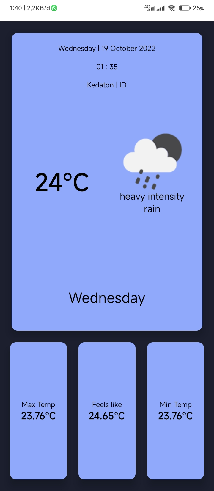

# UTS PAM 2022

## Introduction

my name is **Muhammad Elang Permadani** and I'm a student in **Informatics Engineering** at the **Institut Teknologi Sumatera**. and this is my midterm project for the **PAM** course.

## Simple Weather App React Native

This is a simple weather app made with React Native. It uses the OpenWeatherMap API to get the weather data.



## Dependencies

- React
- React Native
- Expo
- Expo Location
- Expo Status Bar

## Installation

Clone the repository and install the dependencies.

```bash
git clone https://github.com/maybeenang/UTS-PAM-2022.git
cd UTS-PAM-2022
npm install
```

## Usage

```bash
npm start
```

and scan the QR code with the Expo app.

or you can use emulator

```bash
npm run android
```

## Build

If you want to build the app, you can use the Expo CLI and eas-cli.

```bash
npm install -g expo-cli
npm install -g eas-cli
```

Then, you can build the app with the following command.

```bash
eas build
```
